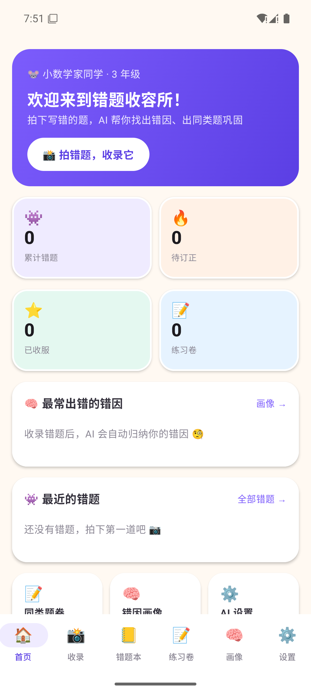
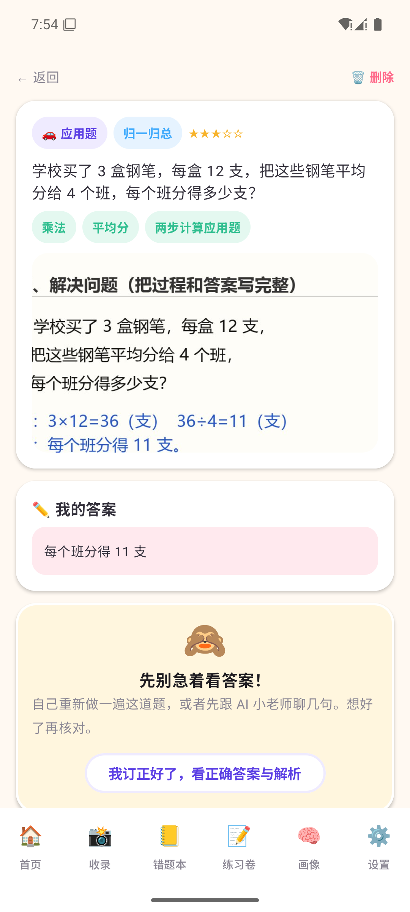
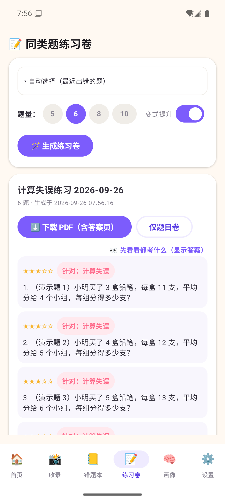
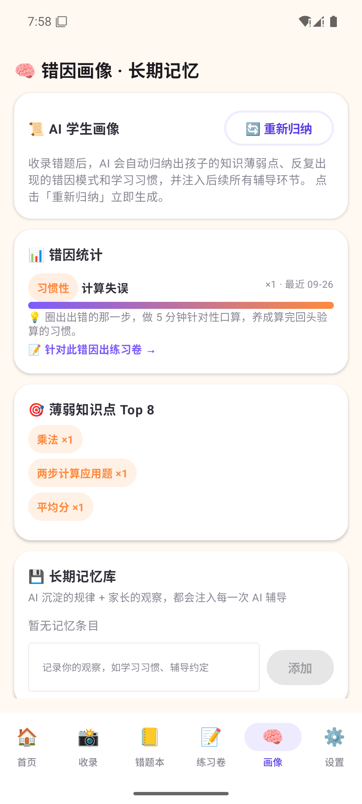

# 👾 错题小怪兽 · Android 版

小学数学 AI 错题本的**原生 Android 客户端**（Kotlin + Jetpack Compose）。与 Web 版（`../mistake-monsters`）共享同一套提示词、错因体系与产品设计，数据独立存于手机本地。

## ✨ 功能（与 Web 版对齐）

| 截图 | |
| --- | --- |
|  |  |
|  |  |

- 📸 **拍照/相册收录**：拍照或从相册选图 → 压缩 → 视觉大模型转录题目（只转录不解题）、识别学生写在纸上的答案
- 🧠 **错因归纳**：AI 对照 9 条预置错因库判断错因，可手动调整；每条错因附辅导策略
- 💾 **长期记忆**：错因模式自动沉淀 + 家长观察记录，汇总为「AI 学生画像」，注入后续所有 AI 环节（每 8 题自动刷新）
- 📝 **同类题练习卷**：按错题/错因出题（含变式提升），出题后 AI 自校验修正算错的答案
- 📄 **PDF 导出**：端上 `PdfDocument` 生成 A4 练习卷（题目+答题框，不可跨页断裂），存到系统「下载」目录，末页附答案与解析
- 🧙 **AI 小老师**：苏格拉底式引导，铁律不给答案；三级提示链逐步展开
- 🙈 **解析门**：正确答案与解析默认遮挡，订正后自行展开
- 🈳 **演示模式**：未配置 Key 时自动启用，全流程可离线体验
- 🔄 **在线更新**：启动自动检查 GitHub Release 新版本，应用内下载（带进度）并引导安装，下载失败自动切换镜像通道

## ⬇️ 安装

从 [Releases](https://github.com/chemmy-11/mistake-monsters/releases) 下载最新 `MistakeMonsters-vX.Y.Z.apk` 安装即可。应用内置在线更新：后续新版本发布后，App 启动时会自动提示，也可以到「设置 → 版本与更新」手动检查。

## 🚀 构建与运行

环境要求：JDK 17、Android SDK（在 `local.properties` 写入 `sdk.dir=...`，已 gitignore）。

```bash
gradle :app:assembleDebug
# 产物
app/build/outputs/apk/debug/app-debug.apk
```

**发布签名**：正式包读取 `keystore/keystore.properties` 指向的密钥库（已 gitignore，请自行备份——密钥丢失将无法覆盖安装）；文件缺失时自动回退 debug 签名。

首次启动 → 「设置」→ 选择服务商（默认**智谱 GLM**，可换阿里百炼/OpenAI/硅基流动/Kimi/DeepSeek）→ 填 API Key → 测试连接。视觉模型与文本模型分开配置，任何 OpenAI 兼容接口均可。

## 🧱 技术要点

| 模块 | 实现 |
| --- | --- |
| UI | Jetpack Compose + Material3，单 Activity 手写导航，Material You 之外自定义儿童向配色（紫 #7C5CFC + 暖米底） |
| 存储 | `SQLiteOpenHelper`（questions/causes/memories/practice_sets 四表）+ SharedPreferences（AI 配置/画像） |
| 网络 | OkHttp 直连 OpenAI 兼容 `/chat/completions`，JSON 容错解析 + 失败重试 |
| PDF | `android.graphics.pdf.PdfDocument` + `StaticLayout` 中文自动换行，题目+答题框整块防跨页 |
| 图片 | TakePicture(FileProvider) / PhotoPicker → 最长边 1600px JPEG → base64 dataURL |
| 提示词 | 从 Web 版逐字移植（`llm/Prompts.kt`），含出题后自校验工序 |

## 🔒 隐私

错题、照片、错因、记忆、密钥全部只存手机本地；仅题目文本与照片发送给你自己配置的 AI 服务商。

## 📁 结构

```
app/src/main/java/com/mistakemonsters/app/
  App.kt            # 单例容器（db / prefs / pipeline / updater）
  MainActivity.kt   # 单 Activity + 底部导航 + 手写路由
  data/             # Models / Taxonomy(题型+错因库) / Db(SQLite) / Prefs
  llm/              # LlmClient(OkHttp+JSON容错+演示模式) / Prompts(全部提示词)
  logic/            # Pipeline(识别→归因→记忆→出题→画像) / WorksheetPdf(端上PDF)
  ui/               # 七个页面 + 主题/公共组件 + UpdateDialog
  update/           # 在线更新：检查(api.github.com) / 下载(镜像回退) / 安装引导
test/               # ui.py 按文字点按的 UI 自动化小工具；gh-release.mjs 发版脚本
```

## 📦 发新版本

```bash
# 1. 升版本：app/build.gradle.kts 里的 versionCode / versionName
# 2. 构建签名包
gradle :app:assembleRelease        # 产物 app/build/outputs/apk/release/app-release.apk
# 3. 创建 GitHub Release 并上传 APK（老用户启动 App 即收到更新提示）
node test/gh-release.mjs vX.Y.Z <apk路径> <notes.md路径> MistakeMonsters-vX.Y.Z.apk
```
